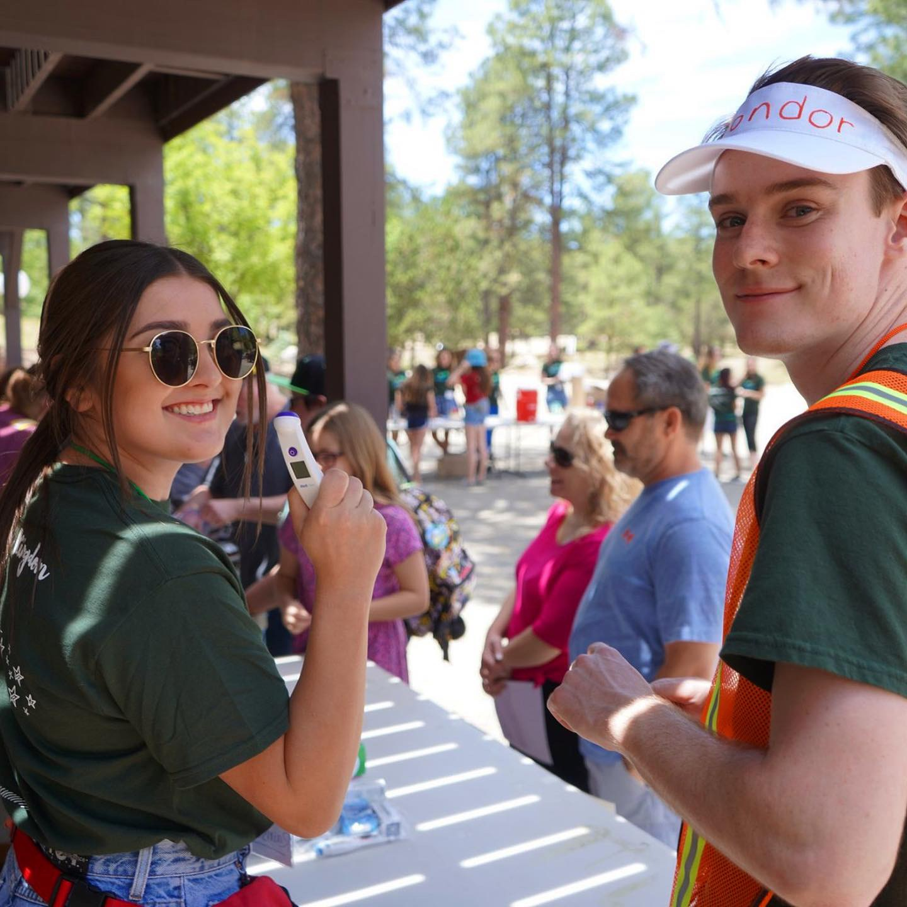

## **Welcome**

### Introduction

Hello! My name is Collin McGuire and I am a second year MHS student in the Department of Epidemiology, Infectious Disease tract at Johns Hopkins University Bloomberg School of Public Health. Before moving to Baltimore, I lived in my hometown of Phoenix (or Mesa/Tempe if you are familiar with the area). Prior to JHSPH, I graduated from Arizona State University with a BA in Global Health and BS in Biochemistry. I am currently working as a Research Assistant in the Key Populations program within the Center for Public Health and Human Rights, where I am performing data analysis on HIV clinic data from Malawi. 

I have past experience with Stata and have bumbled around with R in the past, but am looking forward to gaining comprehensive and marketable skills in R from this course. I am excited for the rest of the semester and can't wait to see what we learn!

### Two Truths and a Lie

1. I am currently missing two adult teeth
2. I have 20/700 vision
3. I liked Emily in Paris

### A Few of My Favorite Things

